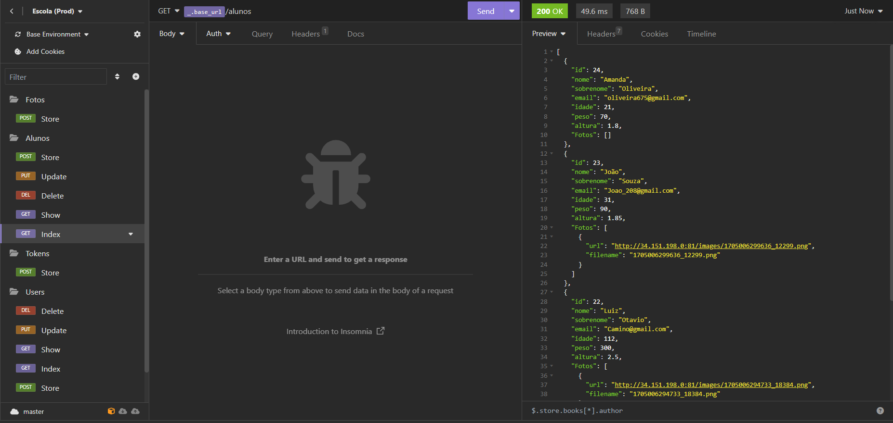

# Projeto API REST com JavaScript, Node.JS, Express e SQL (MariaDB)

Essa API REST é um projeto proposto pelo curso de JavaScript e TypeScript ministrado pelo professor Otávio Miranda. Nessa API, foram utilizados JS, NodeJS, Express e MariaDB, além disso foi utilizado o Insomnia para testar as respostas do servidor através de requisições GET, PUT, UPDATE e DELETE. A API em conjunto o MariaDB é um sistema back-end de gerenciamento da lista de alunos de uma escola ficticia e também o gerenciamento de usuários com acesso ao sistema através de um token de acesso (foi utilizado a biblioteca jsonwebtoken do npm).
- Alunos podem ser criados ou deletados do sistema, além disso pode-se solicitar as informações em JSON e atualizar as informações deles.
- Usuários podem ser criados ou deletados do sistema.
- O login no sistema é feito após colocar o email e senha do usuário que está cadastrado no sistema.
- Sem estar logado, só é possivel solicitar informações dos alunos ou de um aluno especifico.

Além de implementar o CRUD tanto para alunos como para os usuários com acesso ao sistema, também foi adicionado a feature para adicionar fotos para cada aluno registrado no sistema utilizando a biblioteca multer do npm. Para a comunicação com o banco de dados foi utilizado a biblioteca sequelize do npm.

Além disso, fiz o deploy da aplicação através da criação de uma máquina virtual na Google Cloud Platform:
- Configurado chaves SSH no servidor com git bash.
- Foi criado um servidor web com NGINX para fazer proxy reverso com Node.
- Foi utilizado o pm2.
- Nessa máquina, tinha um repositório e outra pasta que recebia dele o código fonte e suas alterações, essa era a pasta usada para o deploy da aplicação.
- O protocolo teve que ser HTTP pois eu não tinha dominio próprio para o site.
